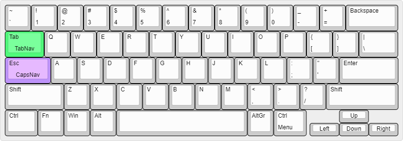

# Base

- The CapsLock key works as an escape key when tapped and as a navigation key modifier when held down.
- The Tab key works as a tab key when tapped and a window navigation key when held down.

## Layout

# CapsNav

CapsLock key is used as modifier to access the navigation keys.

This was originally a fork of an earlier v1 script, but I can't find the original anymore.

## Layout

# TabNav

The Tab key is used as a modifier for windows navigation that can be used for windows snapping, virtual desktop navigation and sending windows across monitors

## Layout

TBA
